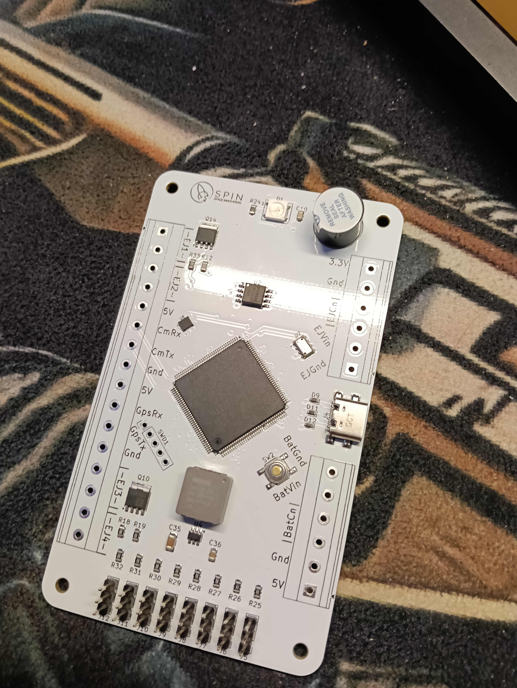
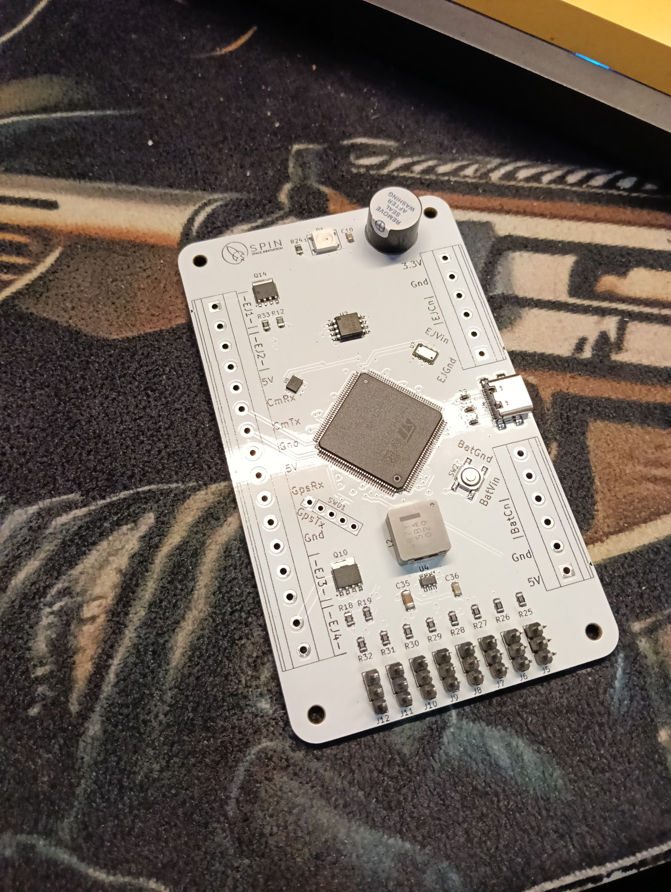
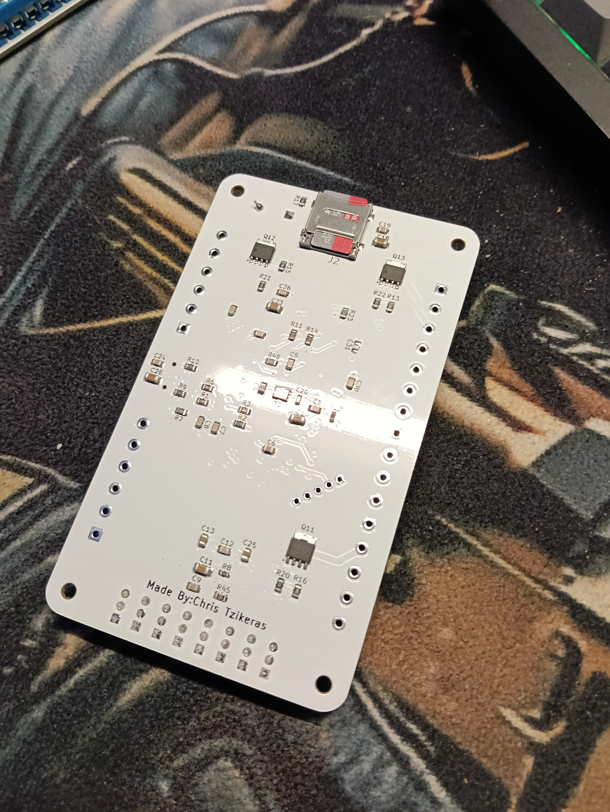
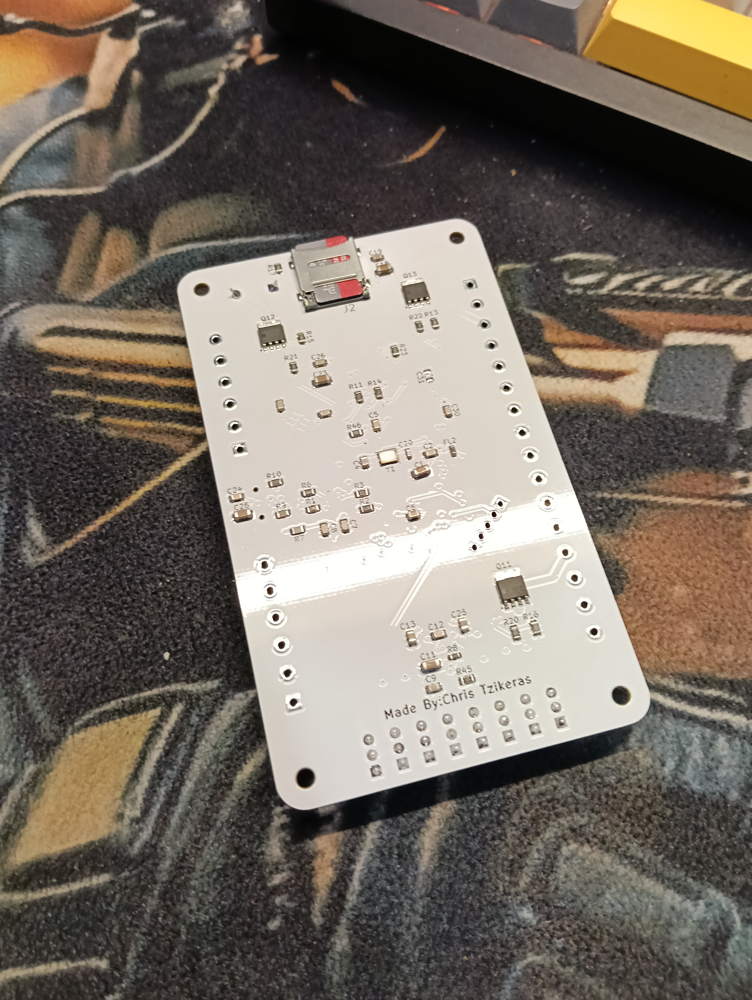

# SPIN Avionics Flight Computer

Competition-level STM32H7-based rocket flight computer currently under development for aerospace and embedded systems applications.

## Project Overview

This project focuses on the development of a compact modular avionics system designed for:

- Real-time telemetry
- State estimation
- Sensor integration
- Flight data logging
- Recovery systems
- Embedded aerospace applications

The system is currently being redesigned and improved for future competition and testing use.

---

## Hardware Features

- STM32H743 microcontroller
- IMU integration
- Barometer integration
- GPS support
- Data logging
- Power management
- USB/UART interfaces
- Compact multi-layer PCB

---

## Current Status

Current development stage:

- PCB redesign in progress
- SMT assembly preparation
- BOM optimization
- Reliability improvements
- Manufacturing verification

---

## Project Images

<p align="center">
  
</p>

<p align="center">
  
</p>

<p align="center">
  
</p>

<p align="center">
  
</p>

<p align="center">
  
</p>

<p align="center">
  
</p>

<p align="center">
  
</p>

---

## Sponsors

### PCBWay

This project is proudly supported by **PCBWay** through PCB manufacturing and prototyping sponsorship.

PCBWay provided the manufacturing support that made it possible to turn the flight computer design into a real, professionally manufactured PCB.

Without PCBWay's support, this stage of the project would not have been possible. Their contribution has played a major role in helping us bring the SPIN Avionics Flight Computer from a digital design to a real piece of aerospace hardware.

**A sincere thank you to the entire PCBWay team for supporting student engineering and making projects like this possible.**

🌐 **PCBWay:** [https://www.pcbway.com/](https://www.pcbway.com/)

---

## Repository Structure

```text
/Hardware       → KiCad files
/Renders        → PCB renders and photographs
/Documentation  → Project documentation
