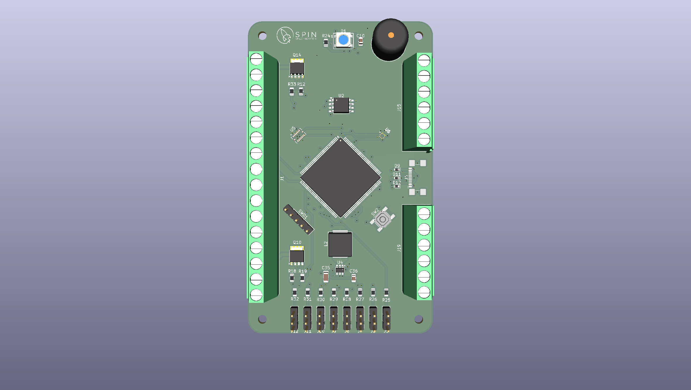
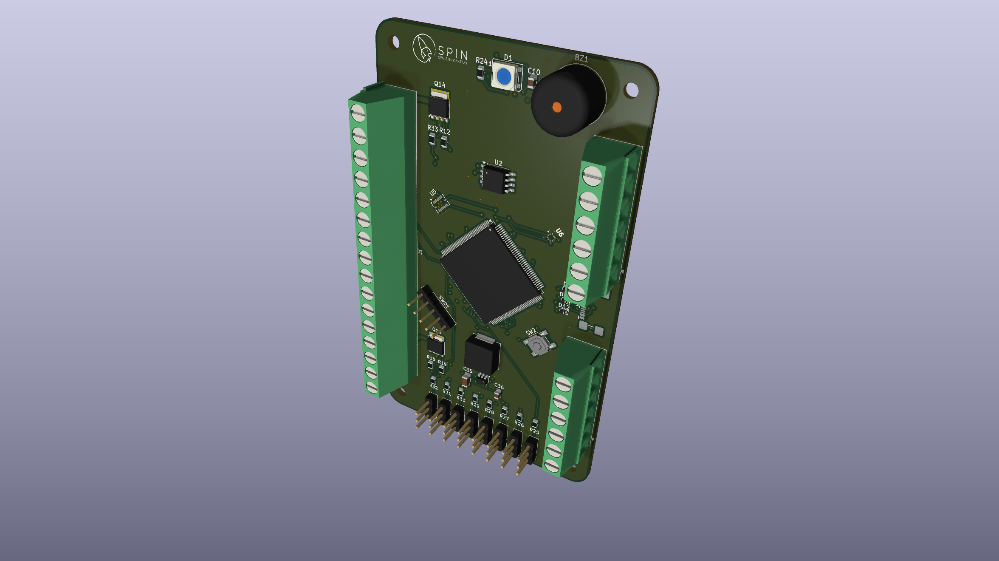
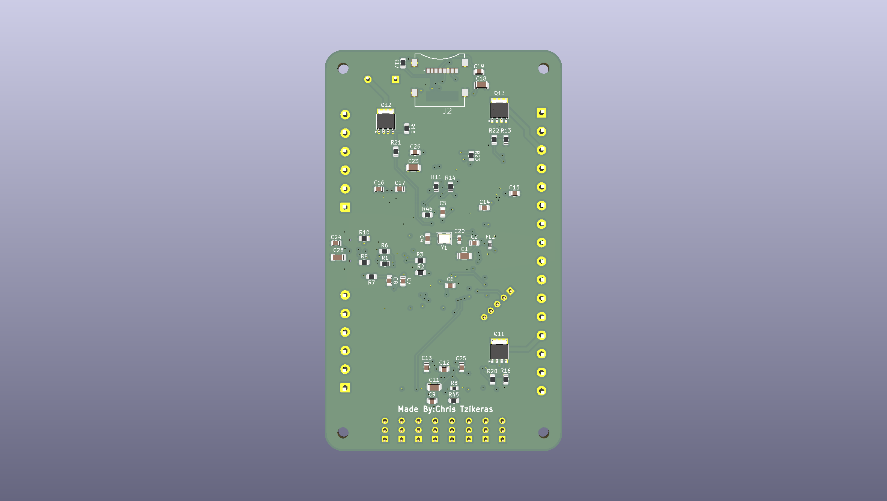

# spin-avionics-flight-computer
# SPIN Avionics Flight Computer

Competition-level STM32H7-based rocket flight computer currently under development for aerospace and embedded systems applications.

## Project Overview

This project focuses on the development of a compact modular avionics system designed for:

- Real-time telemetry
- State estimation
- Sensor integration
- Flight data logging
- Recovery systems
- Embedded aerospace applications

The system is currently being redesigned and improved for future competition and testing use.

---

## Hardware Features

- STM32H743 microcontroller
- IMU integration
- Barometer integration
- GPS support
- Data logging
- Power management
- USB/UART interfaces
- Compact multi-layer PCB

---

## Current Status

Current development stage:

- PCB redesign in progress
- SMT assembly preparation
- BOM optimization
- Reliability improvements
- Manufacturing verification

---

## Project Images

## Project Images

  

  

  

---

## Sponsors

Special thanks to PCBWay for supporting PCB manufacturing and prototyping for this project.

---

## Repository Structure

/Hardware → KiCad files  
/Renders → PCB renders and screenshots  
/Documentation → Project documentation

---

## Disclaimer

This repository is currently under active development and may change significantly over time.
